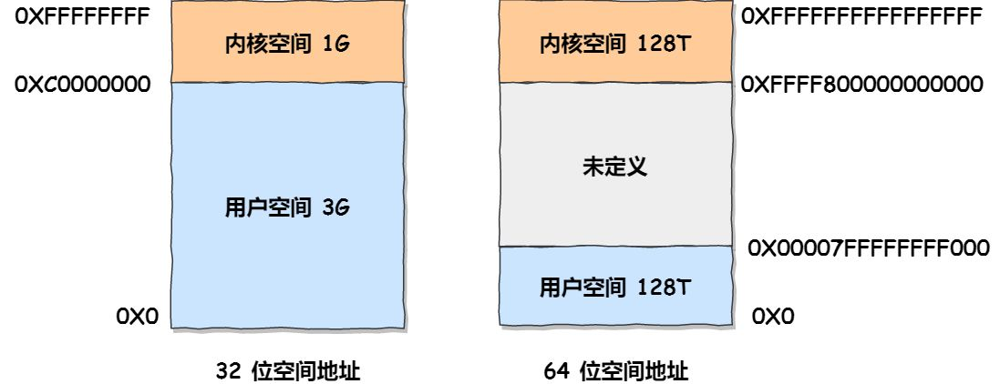
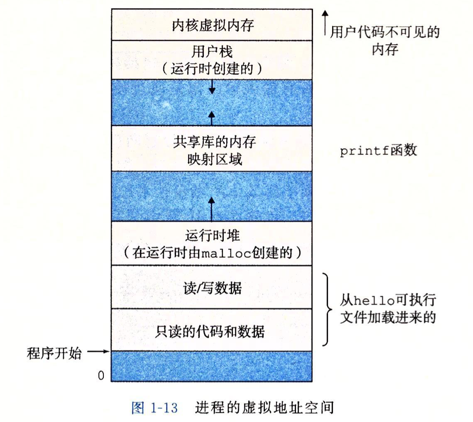

# CSAPP3-notes
## Chapter 1.计算机系统漫游

#### 概念
**计算机系统**：硬件 + **系统**软件

**总线**：贯穿整个系统的一组电子管道，携带信息字节并负责在各个部件间传递。通常被设计成传送定长的字节块，也就是字。现在大多数机器字长为8字节（64位）。

**DRAM**：动态随机存取存储器

**主存**：临时存储设备，存放CPU执行的程序和数据。由**一组DRAM芯片**组成。

**处理器**：CPU，中央处理单元。解释或执行存储在主存上指令的引擎。包含单字节大小的一个指向当前运行指令地址的存储设备：**程序计数器**（PC）。处理器从PC指向的内存处读取指令，解释指令中的位，执行该指令的知识的简单操作（每条指令都是简单的操作），然后更新PC，循环往复。

**SRAM**：静态随机访问存储器，**比DRAM更快，更贵**的存储器

**cache**：cache memory，高速缓存：存在于主存和处理器中间，存放处理器近期可能会用到的主存上的数据。现代计算器系统拥有三级缓存，分别叫做L1 cache、L2 cache、L3 cache，L1比L3更靠近CPU，更快，更小，更贵。每一层都存储器都作为下一层存储器的cache。

**存储器层次结构**：寄存器<->L1 cache<->L2 cache<->L3 cache<->主存<->磁盘

**控制器/适配器**：每个I/O设备都通过一个**控制器**或**适配器**与I/O总线相连。控制器和适配器两者功能相同，都是在总线和I/O设备之前传递信息。两者区别主要在于，控制器是I/O设备本身或者主板上的芯片组，适配器是一块插在主板插槽上的卡（**额外使用的设备**）。

**操作系统**：应用程序层与硬件层中间的软件。
两个功能：
1.防止硬件被失控的应用程序滥用；
2.向应用程序提供简单一致的机制来控制复杂而又通常大不相同的低级硬件设备。
应用程序并不直接访问键盘、显示器、磁盘和主存，它们依靠操作系统提供的服务。
操作系统通过几个基本的抽象概念（进程、虚拟内存、文件）实现以上两个功能。
1.文件是对I/O设备的抽象表示
2.虚拟内存是对主存和磁盘设备的抽象表示
3.进程是对处理器、主存、I/O设备的抽象表示

**进程**：进程是操作系统对一个正在运行的程序的一种抽象。这样的抽象会提供一个假象：即程序独占地使用处理器、主存和I/O设备。

**并发运行**是处理器通过上下文切换使多个进程指令交错执行，形成了**同时运行多个进程的假象**。

**并行运行**
- 线程级并行：多个处理器（或者超线程处理器）可以**同时**运行多个线程的指令
- 指令级别并行：多级流水线，超标量技术使得单个处理器在每个cycle同时处理多条指令
- 单指令多数据并行（SIMD并行）：一条指令产生多个并行执行的的操作

**上下文切换**：操作系统保持跟踪进程运行所需的所有状态信息。这种状态，也就是**上下文**，包括PC和寄存器文件的值，主存的内容。当操作系统决定要把控制权从当前进程转移到某个新进程时，就会进行上下文切换，**即保存当前进程的上下文、恢复新进程的上下文，然后将控制权传递到新进程**。

**内核**：是操作系统代码常驻主存的部分。从一个进程到另外一个进程的转换是由操作系统**内核**（kernel）管理的。
**内核不是一个独立的进程。相反，它是系统管理全部进程所用代码和数据结构的集合**。

**线程（TODO）**：比进程更小的执行单元，一个进程可以有多个线程，每个线程拥有自己的控制流，共享同一个进程上下文。多处理器时，多线程的进程也可以运行的更快。

**虚拟内存**：为进程提供一个假象，即每个进程都在独占地使用内存。**每个进程看到的内存都是一致的**（如何理解？结构都是一致的？），成为虚拟内存空间。基本思想为把一个进程的虚拟地址内容存储在磁盘上，然后用主存作为磁盘的高速缓存。

**虚拟地址空间的分布**：
在Linux 中,**地址空间最上面的区域是保留给操作系统中的代码和数据**的，这对所有进程来说都是一样的。**地址空间的底部区域存放用户进程定义的代码和数据**。
**32位时**，用户空间为0x00000000-0xBFFFFFFF（3G），操作系统地址空间为0xC0000000-0xFFFFFFFF（1G）
**64位时**，用户空间为0x0000000000000000 ~ 0x00007FFFFFFFFFFF（128T），操作系统地址空间为0xFFFF800000000000 ~ 0xFFFFFFFFFFFFFFFF（128T）

**详细分布，从高地址到低地址**

- 系统空间
    - 内核虚拟内存
- 用户空间
    - 栈（编译器用它来实现函数调用）
    - 共享库
    - 堆（运行时由malloc创建的）
    - 程序代码和数据

**32位地址可以表示4GB的范围**：每个地址值对应一个Bytes，2^32 Bytes = 2^22 KB = 2^12 MB = 2^2 GB = 4GB

**文件**：文件即为字节序列。
每个I/O设备，包括磁盘、键盘、显示器，甚至网络，都可以看成是文件。系统中所有输入输出都是通过使用一小组成为Unix I/O的系统函数调用读写文件来实现的（？）。

**阿姆达定律**：想要显著加速整个系统，必须提升全系统中相当大的部分的速度。

#### 知识点

**指令操作围绕着主存、寄存器文件（register file/register）、算术/逻辑单元（ALU）进行**。常见操作如下
1.加载（load）：从主存复制一个字节或者一个字到寄存器，会覆盖原有值
2.存储（store）：从寄存器复制一个字节或一个字到主存某个位置，会覆盖原有值
3.操作：把两个寄存器的内容复制到ALU，ALU对这两个字作算术运算，并将结果存放在一个寄存器，会覆盖原有值
4.跳转：从指令本身中抽取一个字（**并不确切？**），并将这个字复制到PC中，会覆盖原有值

**指令级架构与微体系架构区别**：指令级架构描述每条机器指令的效果；微体系结构描述的是处理器实际上是如何实现的。

**Shell中运行Helloworld程序的细节**：
1.shell程序指令其指令，等待用户输入命令
2.用户输入字符串`./hello`后,shell程序将字符逐一读入寄存器，再把它存放到内存
3.用户输入回车键，shell程序结束此次命令的输入，shell执行一系列指令来加载可执行的`hello`文件
4.hello可执行文件中的代码和数据从磁盘被复制到主存，数据中包含将要被输出的字符串`hello world!`
5.hello可执行文件的指令被处理器执行，这些指令将字符串`hello world!`的字节数据从主存复制到寄存器文件，再从寄存器文件复制到显示设备，最终显示在屏幕上。

